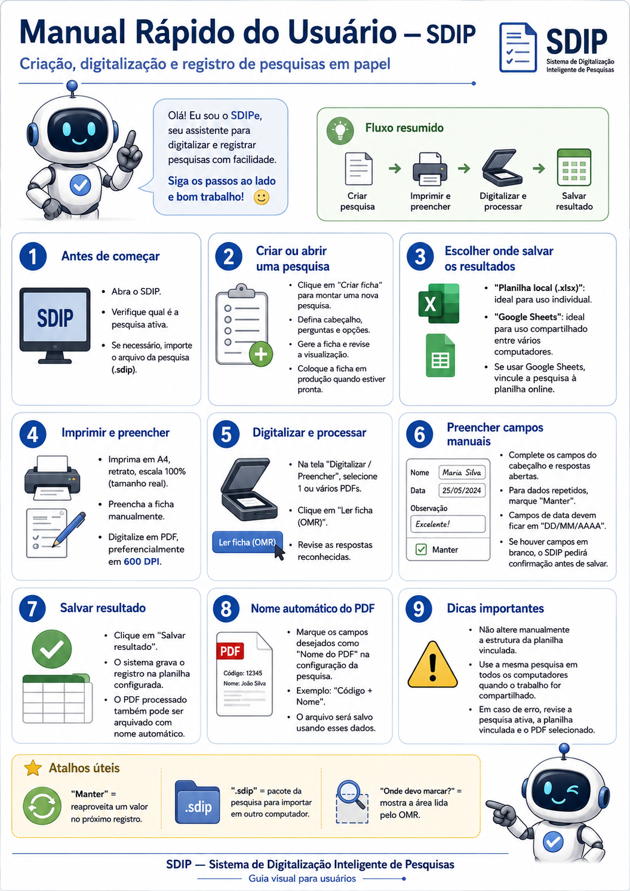

# Manual do Usuário — SDIP

## Sistema de Digitalização Inteligente de Pesquisas

Este manual explica, de forma simples, como utilizar o SDIP para criar pesquisas, imprimir fichas, digitalizar formulários preenchidos e salvar os resultados.



---

# 1. O que é o SDIP?

O SDIP é um programa para auxiliar pesquisas realizadas em papel.

O fluxo básico é:

```text
Criar a pesquisa
        ↓
Gerar a ficha
        ↓
Imprimir
        ↓
Preencher no papel
        ↓
Digitalizar
        ↓
Ler no SDIP
        ↓
Conferir
        ↓
Salvar os resultados
```

O usuário não precisa entender como funcionam ArUco, OMR, coordenadas ou processamento de imagens.

O SDIP cuida dessas etapas automaticamente.

---

# 2. Abrindo o programa

Abra o:

```text
SDIP.exe
```

A janela principal será exibida.

Antes de iniciar uma digitalização, confira qual pesquisa está ativa.

---

# 3. Criando uma pesquisa

Para criar uma nova pesquisa:

1. abra a área de criação de ficha;
2. informe o nome da pesquisa;
3. configure o cabeçalho;
4. adicione as perguntas;
5. adicione seções, se necessário;
6. configure as opções de resposta;
7. adicione perguntas abertas, quando necessário;
8. escolha uma logo, se desejar;
9. gere a ficha.

---

# 4. Campos do cabeçalho

O cabeçalho contém informações que serão preenchidas manualmente pelo operador.

Exemplos:

```text
Data
Código
Nome
Comunidade
Entrevistador
Bairro
Número do imóvel
```

Cada pesquisa pode utilizar campos diferentes.

---

# 5. Campos de data

Se um campo for configurado como data, utilize:

```text
DD/MM/AAAA
```

Exemplo:

```text
02/09/2026
```

Não utilize:

```text
2/9/26
2026-09-02
02/09/26
```

O SDIP verifica se a data é válida antes de salvar.

---

# 6. Criando perguntas

As perguntas podem ser:

## Resposta única

Quando apenas uma opção deve ser marcada.

Exemplo:

```text
A obra foi concluída?

[ ] Sim
[ ] Não
```

## Resposta múltipla

Quando mais de uma opção pode ser marcada.

Exemplo:

```text
Quais serviços foram realizados?

[ ] Pintura
[ ] Elétrica
[ ] Hidráulica
```

## Resposta aberta

Quando a resposta será escrita manualmente.

Exemplo:

```text
Qual problema foi identificado?

____________________________________
```

Depois da digitalização, o operador poderá digitar essa resposta no SDIP.

---

# 7. Seções

As seções servem apenas para organizar a pesquisa.

Exemplo:

```text
1. Infraestrutura

1.1 A obra foi concluída?
1.2 Houve algum problema?

2. Atendimento

2.1 O atendimento foi adequado?
```

As seções não geram colunas na planilha.

---

# 8. Gerando a ficha

Depois de configurar a pesquisa, gere a ficha.

O SDIP organiza automaticamente:

* cabeçalho;
* perguntas;
* opções;
* caixas de marcação;
* páginas;
* marcadores necessários para leitura.

Revise a ficha antes de colocá-la em produção.

---

# 9. Onde devo marcar?

Na visualização da ficha existe a opção:

```text
Onde devo marcar?
```

Ela mostra visualmente a área que o SDIP analisa dentro das caixas.

Use essa função quando quiser verificar onde a marca deve ser feita.

O destaque mostrado nessa tela não é colocado no PDF original e não aparece na impressão.

---

# 10. Colocando a ficha em produção

Quando a estrutura da pesquisa estiver correta, coloque a ficha em produção.

Depois disso, a ficha passa a representar oficialmente aquela versão da pesquisa.

Evite alterar a estrutura de uma pesquisa que já está sendo utilizada.

Mudanças estruturais devem ser realizadas através de uma nova versão.

---

# 11. Escolhendo onde salvar os resultados

O SDIP pode trabalhar com dois destinos principais.

## Planilha local

Formato:

```text
.xlsx
```

Indicado principalmente quando os resultados serão utilizados em um único computador.

## Google Sheets

Indicado quando várias máquinas precisam enviar resultados para a mesma pesquisa.

Nesse caso, a pesquisa deve ser vinculada à planilha Google correspondente.

---

# 12. Importando uma pesquisa em outro computador

Pesquisas podem ser exportadas em um arquivo:

```text
.sdip
```

Esse arquivo transporta a estrutura necessária da pesquisa para outro computador.

Na outra máquina:

1. abra o SDIP;
2. escolha a opção de importar pesquisa;
3. selecione o arquivo `.sdip`;
4. conclua a importação;
5. confira se a pesquisa correta ficou ativa.

Quando a pesquisa utiliza Google Sheets, as informações necessárias da integração acompanham o pacote.

Configurações locais, como a pasta onde os PDFs serão arquivados, devem ser escolhidas novamente em cada computador.

---

# 13. Imprimindo a ficha

Para preservar a leitura correta, utilize:

```text
Papel: A4
Orientação: Retrato
Escala: 100%
Tamanho real
```

Não utilize opções como:

```text
Ajustar à página
Fit to page
Reduzir para caber
Preencher página
Escala automática
```

Alterar a escala da ficha pode prejudicar a leitura.

---

# 14. Preenchendo a ficha

As respostas devem ser marcadas dentro das caixas destinadas ao preenchimento.

Preencha também as respostas abertas normalmente no papel.

Antes de digitalizar, confira se:

* a ficha está completa;
* as páginas estão presentes;
* as marcações estão visíveis;
* a folha não está danificada.

---

# 15. Digitalizando

Configuração utilizada nos testes do SDIP:

```text
Formato: PDF
Resolução: 600 DPI
```

Sempre que possível, utilize essa configuração.

Salve a digitalização como PDF.

---

# 16. Selecionando os PDFs

Na tela:

```text
Digitalizar / Preencher
```

clique em:

```text
Selecionar ficha(s) PDF
```

Você pode selecionar:

```text
1 PDF
```

ou:

```text
vários PDFs
```

Quando vários arquivos são selecionados, o SDIP cria uma fila.

Exemplo:

```text
Arquivo 1 de 8
Arquivo 2 de 8
Arquivo 3 de 8
...
```

---

# 17. Lendo a ficha

Depois que o PDF for carregado, clique em:

```text
Ler ficha (OMR)
```

O SDIP irá:

```text
analisar a página
        ↓
localizar a ficha
        ↓
corrigir o alinhamento
        ↓
analisar as caixas
        ↓
identificar as marcações
```

Depois da leitura, confira os resultados apresentados.

---

# 18. Sempre confira a leitura

O SDIP automatiza a leitura, mas o operador continua responsável pela conferência.

Antes de salvar:

1. confira as respostas reconhecidas;
2. confira os campos de identificação;
3. digite as respostas abertas;
4. confira a data;
5. confirme que está processando a pesquisa correta.

---

# 19. Preenchendo campos manuais

Os campos de identificação aparecem ao lado da ficha.

Exemplo:

```text
Data:          02/09/2026
Código:        00152
Nome:          Maria Silva
Entrevistador: João
```

Preencha os campos necessários antes de salvar.

---

# 20. Usando a opção Manter

Quando um valor será repetido em várias fichas, utilize:

```text
Manter
```

Exemplo:

```text
Data:          02/09/2026   [X] Manter
Entrevistador: Maria        [X] Manter
Código:        00152        [ ] Manter
Nome:          João         [ ] Manter
```

Depois de salvar:

```text
Data
→ continua preenchida

Entrevistador
→ continua preenchido

Código
→ é limpo

Nome
→ é limpo
```

Isso evita digitar novamente informações repetidas durante o processamento de várias fichas.

---

# 21. Campos vazios

Se algum campo manual ou pergunta aberta estiver vazio, o SDIP avisará antes de salvar.

Você poderá escolher:

```text
Não
```

para voltar e preencher os campos.

Ou:

```text
Sim
```

para salvar mesmo com os campos vazios.

O sistema não apaga o que já foi preenchido quando você cancela o salvamento.

---

# 22. Salvando o resultado

Depois de conferir tudo, clique em:

```text
Salvar resultado
```

O SDIP irá salvar o registro no destino configurado.

Dependendo da pesquisa, o destino pode ser:

```text
XLSX
```

ou:

```text
Google Sheets
```

---

# 23. Arquivamento do PDF

Além de salvar os dados, o SDIP pode guardar uma cópia organizada do PDF processado.

Cada pesquisa pode possuir uma pasta específica para esses arquivos.

Exemplo:

```text
C:\Pesquisas\Processados
```

Também pode ser utilizada uma pasta de rede.

---

# 24. Nome automático do PDF

Durante a criação da pesquisa, determinados campos podem ser marcados como:

```text
Nome do PDF
```

Exemplo:

```text
Código    [X] Nome do PDF
Nome      [X] Nome do PDF
Data      [ ] Nome do PDF
```

Se a ficha possuir:

```text
Código = 00152
Nome = Maria Silva
```

o PDF poderá ser arquivado como:

```text
00152_Maria Silva.pdf
```

---

# 25. Arquivos com o mesmo nome

O SDIP não deve substituir silenciosamente um PDF já arquivado.

Se já existir:

```text
00152_Maria Silva.pdf
```

o próximo poderá ser salvo como:

```text
00152_Maria Silva_2.pdf
```

e depois:

```text
00152_Maria Silva_3.pdf
```

---

# 26. Processando vários PDFs

Quando vários PDFs são selecionados, o SDIP trabalha em sequência.

Fluxo:

```text
PDF 1
 ↓
Ler ficha
 ↓
Conferir
 ↓
Salvar
 ↓
PDF 2
 ↓
Ler ficha
 ↓
Conferir
 ↓
Salvar
 ↓
PDF 3
```

Depois de um salvamento bem-sucedido, o próximo arquivo é carregado automaticamente.

---

# 27. O SDIP não lê o próximo PDF automaticamente

O próximo arquivo é aberto automaticamente, mas a leitura OMR não começa sozinha.

Em cada ficha, clique novamente:

```text
Ler ficha (OMR)
```

Isso permite conferir se o arquivo correto foi carregado antes do processamento.

---

# 28. Quando a fila não avança

O próximo PDF não será carregado se o salvamento atual não for concluído.

Isso pode ocorrer, por exemplo, quando:

* uma data está inválida;
* o usuário cancela;
* existem campos vazios e o salvamento é recusado;
* ocorre erro na planilha;
* ocorre erro no Google Sheets;
* a pasta dos PDFs não está disponível;
* ocorre erro ao arquivar o PDF.

Resolva o problema e tente salvar novamente.

---

# 29. Final da fila

Depois do último PDF, o SDIP informa que a fila foi concluída.

Exemplo:

```text
Fila concluída
```

Nesse momento, você pode selecionar uma nova sequência de PDFs.

---

# 30. Google Sheets

Quando uma pesquisa utiliza Google Sheets, vários computadores podem enviar dados para a mesma planilha.

Exemplo:

```text
Computador A ─┐
              │
Computador B ─┼──→ Google Sheets
              │
Computador C ─┘
```

Use a mesma pesquisa `.sdip` nas máquinas que participarão da coleta.

---

# 31. Não altere a estrutura do Google Sheets

Depois que uma pesquisa estiver vinculada à planilha, não altere manualmente:

* nomes das colunas;
* ordem das colunas;
* quantidade de colunas esperadas.

Antes de salvar, o SDIP verifica se a estrutura continua correta.

Se a estrutura da planilha for alterada, o envio poderá ser bloqueado para evitar que respostas sejam gravadas em colunas erradas.

---

# 32. Se aparecer erro de estrutura da planilha

Verifique:

1. se está usando a planilha correta;
2. se alguma coluna foi renomeada;
3. se alguma coluna foi apagada;
4. se alguma coluna foi adicionada;
5. se a ordem das colunas foi modificada.

Restaure a estrutura correta antes de continuar.

---

# 33. Se a pasta de PDFs não estiver disponível

Isso pode acontecer quando:

* uma pasta foi movida;
* uma pasta de rede está indisponível;
* a unidade mudou;
* outro computador está utilizando caminhos diferentes.

O SDIP poderá solicitar que você escolha novamente a pasta de destino.

Escolha a pasta correta e continue.

---

# 34. Cuidados importantes

Antes de processar uma pesquisa, confira:

```text
Pesquisa ativa correta
PDF correto
Planilha correta
Pasta de PDFs correta
```

Durante o preenchimento:

```text
Confira as respostas reconhecidas
Confira os campos manuais
Confira as datas
```

Antes de salvar:

```text
Faça uma última conferência
```

---

# 35. Resumo rápido

## Criar uma pesquisa

```text
Criar ficha
→ configurar
→ gerar
→ revisar
→ colocar em produção
```

## Utilizar em outro computador

```text
Exportar .sdip
→ levar para outro computador
→ importar
→ conferir pesquisa
```

## Processar uma ficha

```text
Selecionar PDF
→ Ler ficha (OMR)
→ conferir
→ preencher campos
→ Salvar resultado
```

## Processar várias fichas

```text
Selecionar vários PDFs
→ processar
→ salvar
→ próximo PDF
→ repetir
```

---

# 36. Atalhos úteis

### Manter

```text
Manter
```

Reaproveita o valor de um campo no próximo registro.

### .sdip

```text
arquivo.sdip
```

Transporta uma pesquisa para outro computador.

### Onde devo marcar?

```text
Onde devo marcar?
```

Mostra a região utilizada pelo leitor OMR.

### Nome do PDF

```text
Nome do PDF
```

Define quais campos serão utilizados para organizar o nome do PDF processado.

---

# 37. Em caso de problema

Antes de concluir que existe um erro no programa, confira:

1. a pesquisa ativa;
2. o PDF selecionado;
3. a qualidade da digitalização;
4. a planilha vinculada;
5. a pasta dos PDFs;
6. os campos de data;
7. a conexão com a internet, quando utilizar Google Sheets.

Se o problema continuar, registre:

* o que estava tentando fazer;
* qual mensagem apareceu;
* qual pesquisa estava ativa;
* qual etapa apresentou o problema.

Isso facilita a identificação e correção do erro.

---

# 38. Configuração recomendada

## Impressão

```text
A4
Retrato
100%
Tamanho real
```

## Scanner

```text
PDF
600 DPI
```

## Data

```text
DD/MM/AAAA
```

---

# 39. Fluxo completo

```text
CRIAR PESQUISA
      ↓
GERAR FICHA
      ↓
REVISAR
      ↓
COLOCAR EM PRODUÇÃO
      ↓
IMPRIMIR EM A4 / 100%
      ↓
PREENCHER NO PAPEL
      ↓
DIGITALIZAR EM PDF / 600 DPI
      ↓
SELECIONAR NO SDIP
      ↓
LER FICHA (OMR)
      ↓
CONFERIR
      ↓
PREENCHER CAMPOS MANUAIS
      ↓
SALVAR RESULTADO
      ↓
PLANILHA + PDF PROCESSADO
```

---

# Manual visual

Para uma consulta rápida, veja também:


---

# SDIP

**Sistema de Digitalização Inteligente de Pesquisas**

Desenvolvido por **Diogo Barbosa**.
